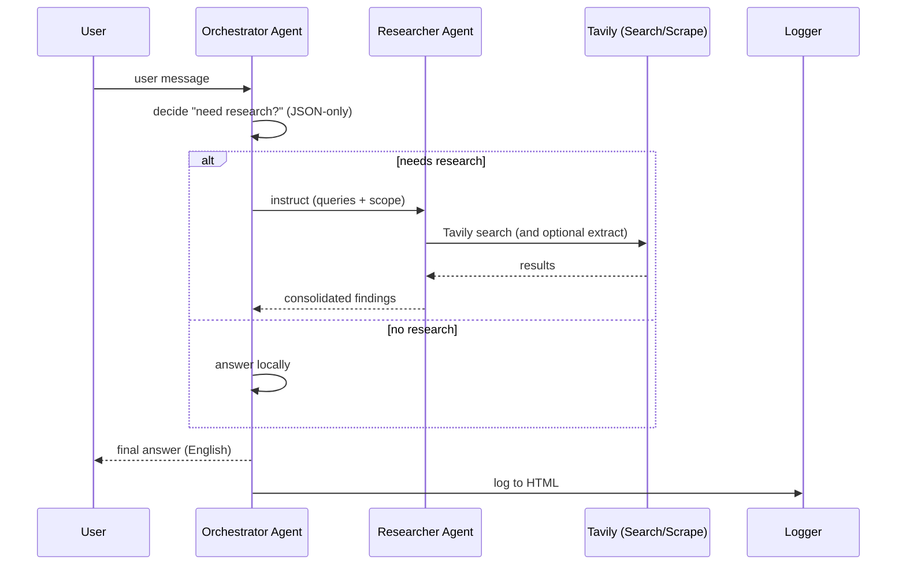

# agent_workflow

A **src-layout** Python CLI that runs an **Orchestrator + Researcher** workflow using **Semantic Kernel**, **Azure OpenAI**, and **Tavily**. It includes a tiny **ephemeral memory**, **thread-safe HTML logging**, and a predictable **JSON decision contract** for routing. English-first. **No Docker**, **no CI** — just the code.

---

## ✨ Features

- **Orchestrator**: decides whether web research is required (strict JSON-only contract).
- **Researcher**: searches the web with **Tavily** and can scrape 1–2 URLs for details.
- **Plugins**: Potato (toy), SearchOnline, ScrapeURL, LogToHTML, Memory.
- **HTML logging**: sanitized entries, one per turn.
- **Ephemeral memory**: per-session facts/notes (exported on exit).

---

## 🧩 Architecture



**Components**
- `agent_workflow.__main__`: entrypoint (`python -m agent_workflow`).
- `agent_workflow.workflow`: all logic (agents, plugins, memory, logging).

---

## 📦 Layout

```text
.
├─ src/agent_workflow/
│  ├─ __init__.py
│  ├─ __main__.py          # python -m agent_workflow
│  └─ workflow.py          # fully commented core
├─ .env.example
├─ requirements.txt
├─ LICENSE
└─ README.md
```

---

## 🔐 Environment

Copy the example and fill your keys:

```bash
cp .env.example .env
```

| Variable                  | Required | Description                                   |
|---------------------------|----------|-----------------------------------------------|
| `AZURE_OPENAI_ENDPOINT`   | ✅       | Your Azure OpenAI endpoint                    |
| `AZURE_OPENAI_KEY`        | ✅       | Azure OpenAI API key                          |
| `AZURE_OPENAI_DEPLOYMENT` | ✅       | Deployment (e.g., `gpt-4o-mini`)              |
| `TAVILY_API_KEY`          | ✅       | Tavily API key                                |
| `LOG_FILE`                | ❌       | HTML log path (default `interaction_log.html`)|

> The HTML log escapes content and writes locally. Avoid committing real logs.

---

## 🚀 Run

```bash
python -m venv .venv
.venv/Scripts/Activate.ps1
pip install -r requirements.txt
# fill in keys .env keys
python -m agent_workflow
```

- Type your question at the prompt.
- Type `exit` to quit; memory and log will be exported/closed.

---

## 📜 Routing Decision – JSON Schema (draft-07)

The orchestrator returns a strict JSON block to decide whether to research. You can validate it downstream.

**Example**
```json
{
  "needs_research": true,
  "reason": "mentions latest price",
  "category": "price",
  "confidence_local": 0.35,
  "queries": [
    "NVIDIA RTX 5090 price — location: United States, language: en-US. Context: 2025-08-22."
  ],
  "geoscope": "United States",
  "ask_user_confirmation": false
}
```

**Schema**
```json
{
  "$schema": "http://json-schema.org/draft-07/schema#",
  "title": "ResearchDecision",
  "type": "object",
  "required": ["needs_research", "reason", "category", "confidence_local", "queries", "geoscope", "ask_user_confirmation"],
  "properties": {
    "needs_research": { "type": "boolean", "description": "True if the answer requires web research." },
    "reason": { "type": "string", "minLength": 1, "description": "Short human explanation." },
    "category": {
      "type": "string",
      "enum": ["events", "news", "price", "law", "howto", "code", "general"],
      "description": "High-level intent bucket."
    },
    "confidence_local": {
      "type": "number",
      "minimum": 0.0,
      "maximum": 1.0,
      "description": "Confidence the question can be answered locally without research."
    },
    "queries": {
      "type": "array",
      "items": { "type": "string" },
      "minItems": 0,
      "description": "Candidate search queries including locale/language hints."
    },
    "geoscope": {
      "type": "string",
      "description": "Geo hint (e.g., 'NYC, USA'); may default to memory or a country."
    },
    "ask_user_confirmation": {
      "type": "boolean",
      "description": "If true and confidence is medium, the CLI may prompt user to confirm research."
    }
  },
  "additionalProperties": true
}
```

**Heuristics (when to research):**
- volatile facts, current events, schedules
- prices/quotes, laws/regulations
- availability/“near me”, releases/versions
- otherwise: stable how-to, math, code explanations → no research

---

## 🗂️ Logging & Memory

- **HTML log**: `LOG_FILE` (default `interaction_log.html`), sanitized entries.
- **Memory export**: on exit → `memory_<session>.json` and `memory_<session>.txt`.
- Ephemeral caps: `MAX_FACTS=50`, `MAX_NOTES=200`.

---

## 🔧 Troubleshooting

- If required env vars are missing, the app lists them and exits with code `1`.
- Tavily timeouts return friendly messages and keep the loop responsive.
- The HTML log footer is appended on exit; if it fails, a warning prints.

---

## 📄 License

MIT © 2025
