# Convo Orchestrator

> Async CLI assistant using **Semantic Kernel**, **Azure OpenAI**, and **Tavily** – with an **Orchestrator** + **Researcher** agent pattern, **HTML logging**, and a tiny **ephemeral memory**. English-first.

 

## ✨ Features

- **Orchestrator** decides when to use the web (news, prices, laws, “near me”, volatile facts).
- **Researcher** performs web search & optional scraping via **Tavily**.
- **English-first** prompts and console UI (with `rich` fallback to plain text).
- **Ephemeral memory**: tiny per-chat memory to store facts/notes (exportable).
- **Thread-safe HTML logging** for each interaction.
- **Robust JSON-only decision contract** to keep the routing predictable.

---

## 🧠 Architecture (high level)

```mermaid
sequenceDiagram
  participant U as User
  participant O as Orchestrator Agent
  participant R as Researcher Agent
  participant T as Tavily (Search/Scrape)
  participant L as Logger

  U->>O: user message
  O->>O: Decide "need research?" (JSON-only)
  alt needs research
    O->>R: instruction (queries, scope)
    R->>T: Search (and optional Scrape 1–2 URLs)
    T-->>R: results
    R-->>O: consolidated findings
  else no research
    O->>O: answer locally
  end
  O-->>U: final answer (English)
  O->>L: log interaction to HTML
```



### Components
- **Orchestrator**: coordinates, decides, composes final answers.
- **Researcher**: web search + scrape helper.
- **Plugins**: Potato (toy), SearchOnline, ScrapeURL, LogToHTML, Memory.
- **HTML Logger**: adds one entry per turn (sanitized, thread-safe).

---

## 📦 Project layout

```
.
├─ src/convo_orchestrator/
│  ├─ __init__.py
│  └─ main.py               # English-first, fully commented
├─ tests/
│  └─ test_smoke.py
├─ .github/workflows/ci.yml
├─ .env.example
├─ pyproject.toml
├─ requirements.txt
├─ Makefile
├─ pre-commit-config.yaml
├─ Dockerfile
├─ scripts/run.sh
└─ README.md
```

---

## 🔐 Environment

Create `.env` from the example and set your keys:

```bash
cp .env.example .env
```

| Variable                 | Required | Description                                               |
|--------------------------|----------|-----------------------------------------------------------|
| `AZURE_OPENAI_ENDPOINT`  | ✅       | Your Azure OpenAI endpoint                                |
| `AZURE_OPENAI_KEY`       | ✅       | Azure OpenAI API key                                      |
| `AZURE_OPENAI_DEPLOYMENT`| ✅       | Deployment name (e.g., `gpt-4o-mini`)                     |
| `TAVILY_API_KEY`         | ✅       | Tavily API key for web search & extraction                |
| `LOG_FILE`               | ❌       | Path to HTML log file (default `interaction_log.html`)    |

> **Privacy note:** The HTML log stores prompts/answers locally and escapes HTML. Do not commit real logs.

---

## 🚀 Quickstart

```bash
# Python 3.10+
python -m venv .venv && source .venv/bin/activate
pip install -r requirements.txt  # or: pip install .[dev]

# Run
convobot
# or
python -m convo_orchestrator.main
```

**Make targets**
```bash
make install   # install with dev deps
make format    # black
make lint      # ruff
make test      # pytest
make run       # convobot
```

**Docker**
```bash
docker build -t convo-orchestrator .
docker run --rm -it --env-file .env convo-orchestrator
```

---

## 📜 Routing Decision Schema (JSON)

The orchestrator decides whether to research using a strict JSON shape.  
**You can rely on these fields in downstream tooling.**

### Example

```json
{
  "needs_research": true,
  "reason": "mentions latest price",
  "category": "price",
  "confidence_local": 0.35,
  "queries": [
    "NVIDIA RTX 5090 price — location: United States, language: en-US. Context: 2025-08-22."
  ],
  "geoscope": "United States",
  "ask_user_confirmation": false
}
```

### JSON Schema (draft-07)

```json
{
  "$schema": "http://json-schema.org/draft-07/schema#",
  "title": "ResearchDecision",
  "type": "object",
  "required": ["needs_research", "reason", "category", "confidence_local", "queries", "geoscope", "ask_user_confirmation"],
  "properties": {
    "needs_research": { "type": "boolean", "description": "True if the answer requires web research." },
    "reason": { "type": "string", "minLength": 1, "description": "Short human explanation." },
    "category": {
      "type": "string",
      "enum": ["events", "news", "price", "law", "howto", "code", "general"],
      "description": "High-level intent bucket."
    },
    "confidence_local": {
      "type": "number",
      "minimum": 0.0,
      "maximum": 1.0,
      "description": "Confidence the question can be answered locally without research."
    },
    "queries": {
      "type": "array",
      "items": { "type": "string" },
      "minItems": 0,
      "description": "Candidate search queries including locale/language hints."
    },
    "geoscope": {
      "type": "string",
      "description": "Geo hint (e.g., 'NYC, USA'); may default to memory or a country."
    },
    "ask_user_confirmation": {
      "type": "boolean",
      "description": "If true and confidence is medium, the CLI may prompt user to confirm research."
    }
  },
  "additionalProperties": true
}
```

**Heuristics (when research is needed):**
- volatile facts, current events, schedules
- prices/quotes, laws/regulations
- availability/“near me”, releases/versions
- otherwise: stable how-to, math, code explanations → no research

---

## 🗂️ Logging & Memory

- **HTML log** (`LOG_FILE`): one entry per interaction with sanitized content.
- **Memory export**: on exit the app writes `memory_<session>.json` and `memory_<session>.txt`.
- **Ephemeral memory** max sizes: `MAX_FACTS=50`, `MAX_NOTES=200`.

---

## 🧪 Testing

- `tests/test_smoke.py` ensures the package imports and the `main` entry exists.
- Add your own tests with `pytest` and (optionally) `pytest-asyncio` for coroutines.

---

## 🧹 Quality

- **Ruff** for linting, **Black** for formatting.  
- `pre-commit` hooks configured; run `pre-commit install` after cloning.

---

## 🔧 Troubleshooting

- **Missing env**: the app will print which variables are missing and exit `1`.
- **Tavily timeouts**: search/extract calls return friendly messages and keep the app responsive.
- **HTML log not closing**: a footer is appended on shutdown; if it fails, a warning is printed.

---

## 🔒 Security Notes

- Don’t check real `.env` or logs into Git.
- Be mindful that prompts & responses may contain sensitive data; sanitize upstream inputs.

---

## 📄 License

MIT © 2025
